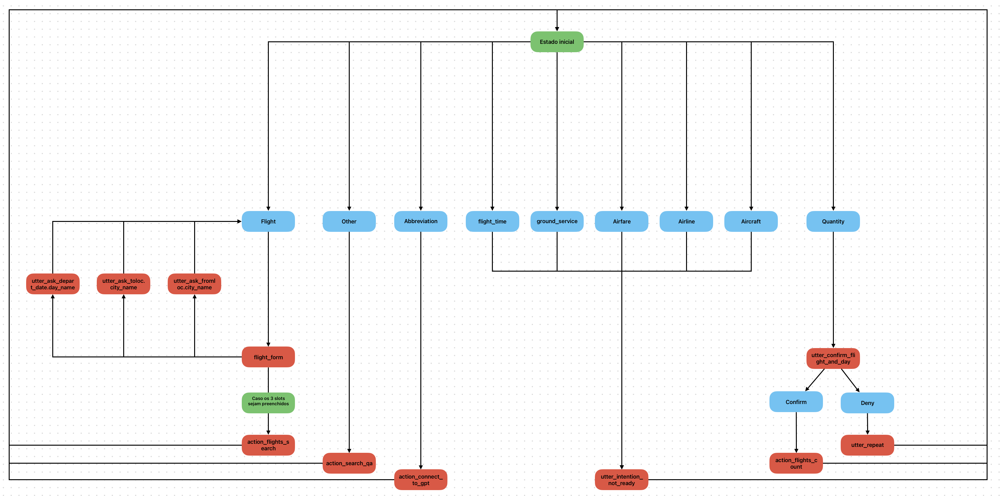

# Chatbot para Arline Travel Information System (ATIS) - IF144 Processamento de Linguagem Natural

## Sobre o Projeto

Este projeto foi desenvolvido como parte da disciplina IF144 - Processamento de Linguagem Natural, do curso de Ciência da Computação na Universidade Federal de Pernambuco (UFPE). O objetivo é construir um chatbot focado em um domínio específico. No nosso caso, escolhemos [um conjunto de ATIS](https://github.com/howl-anderson/ATIS_dataset) disponível publicamente. 

## Apresentação do Projeto

A apresentação em vídeo projeto pode ser acessado em: https://drive.google.com/file/d/1CL4Ve8sK_0mzD435nG9ZF6c5BI3kaViP/view?usp=sharing

## Funcionalidades

O chatbot é capaz de:
- Classificar intenções e extrair informações específicas das perguntas dos usuários.
- Responder a perguntas relacionadas a voos, utilizando um modelo de Q&A.

## Tecnologias Utilizadas

- **Classificador**: Bag-of-Words com SVM, CNN, LSTM, e Transformers.
- **Extrator**: LSTM e Transformers.
- **Chatbot**: Rasa.
- **Q&A**: Typesense.
- Também conectamos com a API da OpenAI para poder responder perguntas relacionadas à intenção `atis_abbreviation`.

## Esquema do Modelo de Conversa

O nosso chatbot construído com o auxílio do Rasa segue o seguinte fluxo de conversação:



## Rodando o rasa

É necessário rodar o servidor de actions:
```
cd rasa && rasa run actions
```

Então, podemos conversar com o chatbot a partir de:
```
cd rasa && rasa shell
```

### Actions

É necessário inserir as keys para API da OpenAI e do Typesense. Caso seja necessário, pedir a wrs@cin.ufpe.br ou a vsob@cin.ufpe.br.

Além disso, é necessário adicionar o path correto do csv na linha 101 do arquivo `actions.py`.


